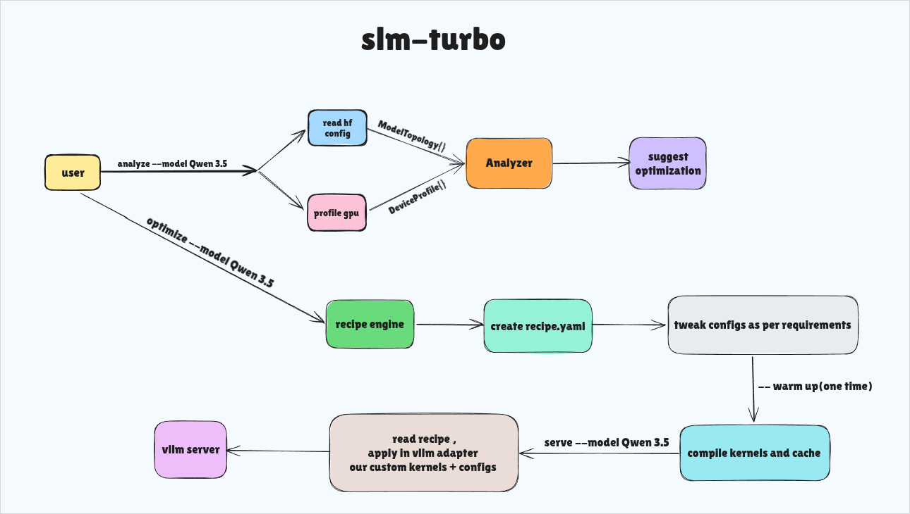

<p align="center">
  
</p>
<p align="center"><strong>Profile and auto-tune local AI for your specific GPU.</strong></p>

Automated inference optimizer for LLMs. Profiles your GPU, classifies the bottleneck with a roofline model, and prescribes targeted fixes — KV quantization, prefix caching, chunked prefill, backend selection. Outputs a version-controlled recipe, not magic flags.

## Architecture



## How it works

```
slm-turbo analyze   →  probes model topology + GPU. classifies bottleneck.
                        prints: "memory-bound. 2.1 GB KV cache at 4096 tokens."

slm-turbo optimize  →  generates recipe.yaml. 4 optimizers evaluated per (model, GPU).
                        prints: "+52% throughput, -34% latency expected."

slm-turbo warmup    →  downloads weights, JIT-compiles Triton kernels, verifies recipe.
                        one-time. every serve after is instant.

slm-turbo serve     →  reads recipe.yaml, injects config into vLLM, launches server.
                        metrics on :8000/metrics.

slm-turbo status    →  live: tokens/sec, p50/p99 latency, GPU%, KV cache usage.
```

## What's under the hood

**Roofline profiler** — analytical by default (math, no GPU load). Falls back to empirical forward-pass when model fits VRAM — real CUDA overhead, real fragmentation, real bandwidth numbers. No spreadsheet guesses.

**Custom Triton kernels** — fused KV cache dequant + attention. Asymmetric quantization: keys 4-bit, values 2-bit. Dequant in registers — never writes fp16 back to DRAM. Targets sm_75+ (GTX 1650 and up).

**Recipe engine** — 4 optimizers evaluated per (model, GPU) pair. Declarative YAML output. Human-readable, editable, diffable in git.

**Pluggable backends** — one recipe, any serving runtime. vLLM today. SGLang and TensorRT-LLM planned. No forks — we inject at each backend's config boundary.

## Targets

| | |
|---|---|
| GPUs | NVIDIA Turing+ (sm_75). GTX 1650 stress-tested. |
| Models | Any HuggingFace transformer. VLMs, 1B–70B+. |
| Backends | vLLM · SGLang (planned) · TensorRT-LLM (planned) |

## Quick start

```bash
pip install slm-turbo

slm-turbo doctor              # check env: CUDA, PyTorch, vLLM, GPU, permissions
slm-turbo analyze  --model meta-llama/Llama-2-7b-hf
slm-turbo optimize --model meta-llama/Llama-2-7b-hf
slm-turbo warmup   --model meta-llama/Llama-2-7b-hf
slm-turbo serve    --model meta-llama/Llama-2-7b-hf --config ~/.slm-turbo/recipes/llama-2-7b*.yaml
slm-turbo status
```
